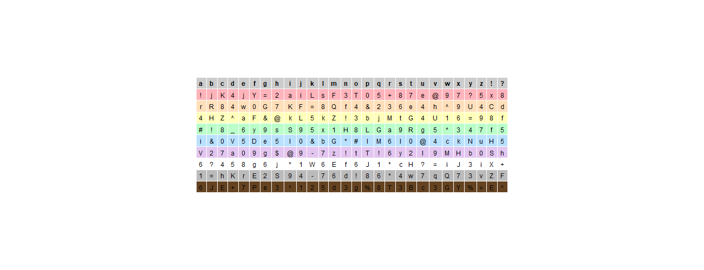
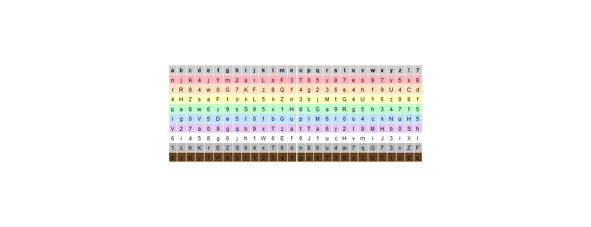

# Password Card

Inspired by [Password Card](https://www.passwordcard.org/), I wanted to create my own version in R to better understand the process and increase replicability. This is essentially a physical password manager.

Using one password (password123 for this example), you can generate a physical card that securely stores complicated passwords for all your sites. The different rows have colors corresponding to the site, and the columns have different letters. For example, you can associate Facebook with F and Blue. Then your password can be any convention you choose, the easiest of which could be "The 10 characters to the right". I made two sides to correspond with sites that allow for special characters. As an example, this is both sides of the card generated by "password123"

